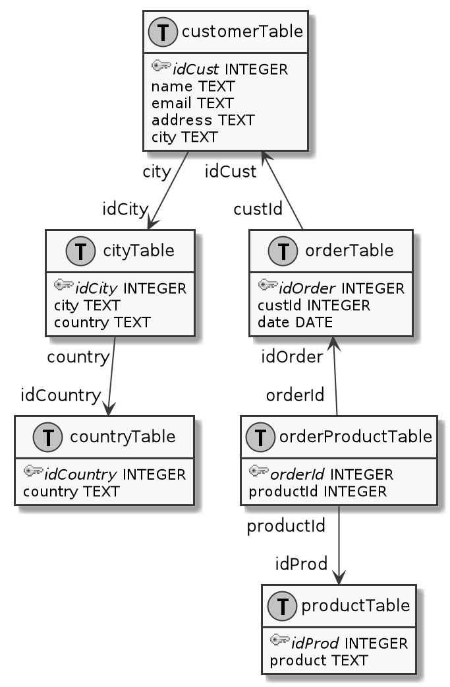

# PlantUML to SQL
 
Takes a tweaked PlantUML class diagram, that serves as a database diagram, and
spit out the SQL commands needed to create the tables.

## To do
 * Support more constraints (only PRIMARY KEY and FOREIGN KEY at this time)
 
## Running

Run the program with the PlantUML file as argument.

    $ ./dbdia2sql.py db.puml 
    
    CREATE TABLE countryTable(
     idCountry INTEGER PRIMARY KEY,
     country TEXT
    );
    CREATE TABLE productTable(
     idProd INTEGER PRIMARY KEY,
     product TEXT
    );
    CREATE TABLE cityTable(
     idCity INTEGER PRIMARY KEY,
     city TEXT,
     country TEXT,
     FOREIGN KEY(country) REFERENCES countryTable(idCountry)
    );
    CREATE TABLE customerTable(
     email TEXT,
     address TEXT,
     city TEXT,
     name TEXT,
     idCust INTEGER PRIMARY KEY,
     FOREIGN KEY(city) REFERENCES cityTable(idCity)
    );
    CREATE TABLE orderTable(                                                                                                                                                                                                   
     date DATE,                                                                                                                                                                                                                
     idOrder INTEGER PRIMARY KEY,                                                                                                                                                                                              
     custId INTEGER,                                                                                                                                                                                                           
     FOREIGN KEY(custId) REFERENCES customerTable(idCust)                                                                                                                                                                      
    );                                                                                                                                                                                                                         
    CREATE TABLE orderProductTable(                                                                                                                                                                                            
     productId INTEGER,                                                                                                                                                                                                        
     orderId INTEGER PRIMARY KEY,                                                                                                                                                                                              
     FOREIGN KEY(productId) REFERENCES productTable(idProd),                                                                                                                                                                   
     FOREIGN KEY(orderId) REFERENCES orderTable(idOrder)                                                                                                                                                                       
    ); 

**Input diagram**

