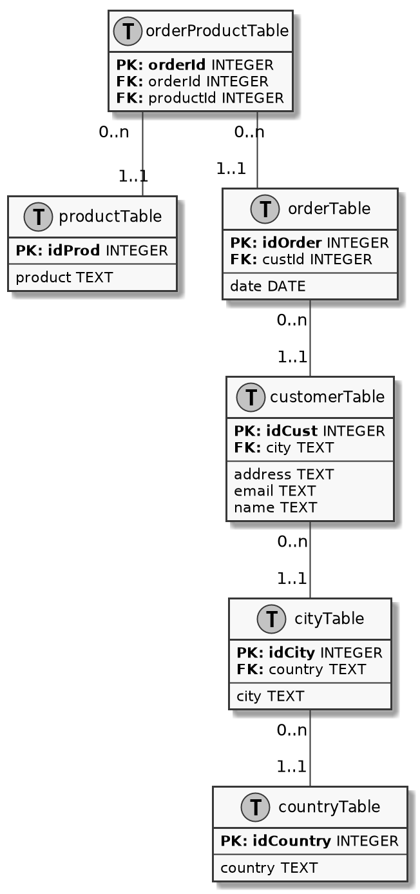

# PlantUML to SQL
 
Takes a tweaked PlantUML class diagram, that serves as a database diagram, and
spit out the SQL commands needed to create the tables.

## To do
 * Support more constraints (only PRIMARY KEY and FOREIGN KEY at this time)
 
## Running

Run the program with the PlantUML file as argument.

    $ ./dbpuml2sql.py db.puml 
    
    CREATE TABLE productTable(
        idProd INTEGER PRIMARY KEY,
        product TEXT
    );
    CREATE TABLE countryTable(
        idCountry INTEGER PRIMARY KEY,
        country TEXT
    );
    CREATE TABLE cityTable(
        idCity INTEGER PRIMARY KEY,
        country TEXT,
        FOREIGN KEY(country) REFERENCES countryTable(idCountry),
        city TEXT
    );
    CREATE TABLE customerTable(
        idCust INTEGER PRIMARY KEY,
        city TEXT,
        FOREIGN KEY(city) REFERENCES cityTable(idCity),
        address TEXT,
        email TEXT,
        name TEXT
    );
    CREATE TABLE orderTable(
        idOrder INTEGER PRIMARY KEY,
        custId INTEGER,
        FOREIGN KEY(custId) REFERENCES customerTable(idCust),
        date DATE
    );
    CREATE TABLE orderProductTable(
        orderId INTEGER,
        FOREIGN KEY(orderId) REFERENCES orderTable(idOrder),
        productId INTEGER,
        FOREIGN KEY(productId) REFERENCES productTable(idProd)
    ); 

**Input diagram**

