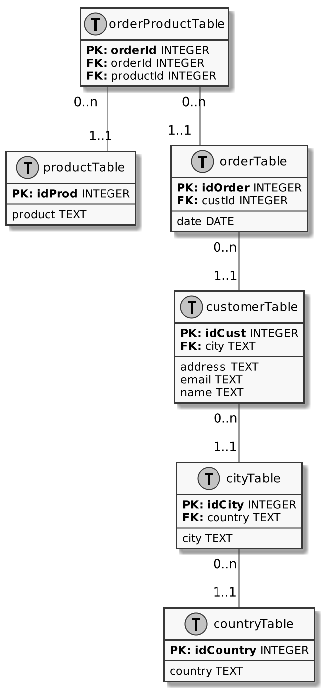

# SQL to Plant UML
 
Convert SQL CREATE TABLE statements into a tweaked PlantUML class diagram.

## Example

The following SQL:

    CREATE TABLE productTable(
        product TEXT,
        idProd INTEGER PRIMARY KEY
    );
    
    CREATE TABLE countryTable(
        idCountry INTEGER PRIMARY KEY,
        country TEXT
    );
    
    CREATE TABLE cityTable(
        country TEXT,
        city TEXT,
        idCity INTEGER PRIMARY KEY,
        FOREIGN KEY(country) REFERENCES countryTable(idCountry)
    );
    
    CREATE TABLE customerTable(
        address TEXT,
        email TEXT,
        idCust INTEGER PRIMARY KEY,
        name TEXT,
        city TEXT,
        FOREIGN KEY(city) REFERENCES cityTable(idCity)
    );
    
    CREATE TABLE orderTable(
        idOrder INTEGER PRIMARY KEY,
        date DATE,
        custId INTEGER,
        FOREIGN KEY(custId) REFERENCES customerTable(idCust)
    );
    
    CREATE TABLE orderProductTable(
        orderId INTEGER PRIMARY KEY,
        productId INTEGER,
        FOREIGN KEY(orderId) REFERENCES orderTable(idOrder),
        FOREIGN KEY(productId) REFERENCES productTable(idProd)
    );

Becomes this Plant UML diagram:

    @startuml
    
    skinparam monochrome true
    skinparam linetype ortho
    scale 2
    
    !define table(x) class x << (T,#FFAAAA) >>
    !define view(x) class x << (V,#FFAAAA) >>
    !define ent(x) class x << (E,#FFAAAA) >>
    
    !define primary_key(x) <b>PK: x</b>
    !define foreign_key(x,reference) <b>FK: </b>x
    hide methods
    hide stereotypes
    
    table(productTable) {
        primary_key(idProd) INTEGER
        ---
        product TEXT
    }
    
    table(countryTable) {
        primary_key(idCountry) INTEGER
        ---
        country TEXT
    }
    
    table(cityTable) {
        primary_key(idCity) INTEGER
        foreign_key(country,countryTable.idCountry) TEXT
        ---
        city TEXT
    }
    
    table(customerTable) {
        primary_key(idCust) INTEGER
        foreign_key(city,cityTable.idCity) TEXT
        ---
        address TEXT
        email TEXT
        name TEXT
    }
    
    table(orderTable) {
        primary_key(idOrder) INTEGER
        foreign_key(custId,customerTable.idCust) INTEGER
        ---
        date DATE
    }
    
    table(orderProductTable) {
        primary_key(orderId) INTEGER
        foreign_key(orderId,orderTable.idOrder) INTEGER
        foreign_key(productId,productTable.idProd) INTEGER
    }
    
    cityTable "0..n" -- "1..1" countryTable
    customerTable "0..n" -- "1..1" cityTable
    orderTable "0..n" -- "1..1" customerTable
    orderProductTable "0..n" -- "1..1" orderTable
    orderProductTable "0..n" -- "1..1" productTable
    
    @enduml
    
Which renders to this diagram:

    

## Running

Run the program with the SQL file as argument.

    $ ./dbsql2puml.py example/customer.sql

    @startuml
    
    skinparam monochrome true
    skinparam linetype ortho
    scale 2
    
    !define table(x) class x << (T,#FFAAAA) >>
    !define view(x) class x << (V,#FFAAAA) >>
    !define ent(x) class x << (E,#FFAAAA) >>
    
    !define primary_key(x) <b>PK: x</b>
    !define foreign_key(x,reference) <b>FK: </b>x
    hide methods
    hide stereotypes
    
    table(productTable) {
        primary_key(idProd) INTEGER
        ---
        product TEXT
    }
    
    table(countryTable) {
        primary_key(idCountry) INTEGER
        ---
        country TEXT
    }
    
    table(cityTable) {
        primary_key(idCity) INTEGER
        foreign_key(country,countryTable.idCountry) TEXT
        ---
        city TEXT
    }
    
    table(customerTable) {
        primary_key(idCust) INTEGER
        foreign_key(city,cityTable.idCity) TEXT
        ---
        address TEXT
        email TEXT
        name TEXT
    }
    
    table(orderTable) {
        primary_key(idOrder) INTEGER
        foreign_key(custId,customerTable.idCust) INTEGER
        ---
        date DATE
    }
    
    table(orderProductTable) {
        primary_key(orderId) INTEGER
        foreign_key(orderId,orderTable.idOrder) INTEGER
        foreign_key(productId,productTable.idProd) INTEGER
    }
    
    cityTable "0..n" -- "1..1" countryTable
    customerTable "0..n" -- "1..1" cityTable
    orderTable "0..n" -- "1..1" customerTable
    orderProductTable "0..n" -- "1..1" orderTable
    orderProductTable "0..n" -- "1..1" productTable
    
    @enduml
