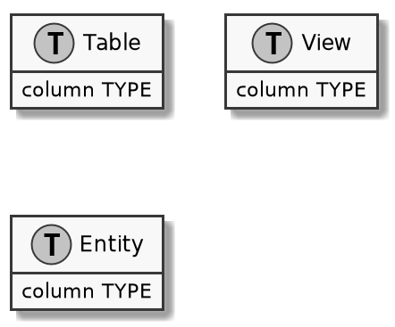
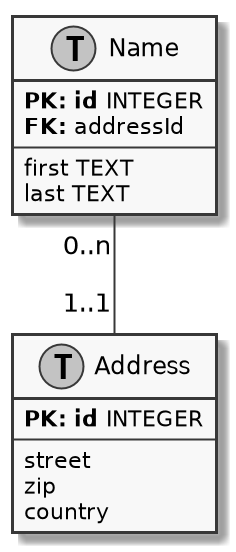

# Database Plant UML subset reference #

## Introduction ##

This document describes the format used to draw database diagrams using
[Plant UML](http://plantuml.com), a language to describe a range of UML
diagram types as text files.

Plant UML is not meant to render database diagrams, but using a class
diagram and some additional macros, quite usable diagrams can be written.

## Header ##

The generated Plant UML begins with the start tag.

    @startuml

This start tag is followed by a static header setting up some specifics for
the database diagram.    
First some formatting to make the diagram monochrome, the lines straight, and
scale the output by a factor of 2 (*You might want to disable the last one
as it creates rather huge images*).
  
    skinparam monochrome true
    skinparam linetype ortho
    scale 2
    
Next are three macros that is used to create the  tables, views, and entities.
Each type is show below.

    !define table(x) class x << (T,#FFAAAA) >>
    !define view(x) class x << (V,#FFAAAA) >>
    !define ent(x) class x << (E,#FFAAAA) >>

 
    
Then the macros to create primary and foreign keys are defined. The foreign key
macro uses a hack, where the foreign key reference is stored in dot format 
(*table.column*) in the second argument of the macro. This variable is not used
by Plant UML to render the diagram, but provides the needed information to
convert the digram back in to SQL statements. 
    
    !define primary_key(x) <b>PK: x</b>
    !define foreign_key(x,reference) <b>FK: </b>x
    
Here is an example of using these macros:

...

    table(Name) {
        primary_key(id) INTEGER
        foreign_key(addressId, Address.id)
        ---
        first TEXT
        last TEXT
    }
    
    table(Address) {
        primary_key(id) INTEGER
        ---
        street
        zip
        country
    }
    
    Name "0..n" -- "1..1" Address

...    

These tables renders like this:

Last item in the header disables some unwanted formatting used in regular class
diagrams.
    
    hide methods
    hide stereotypes

## Content ##

After the header comes the actual diagram, here are some more details using
the above example.

Definition of table "Name".

        table(Name) {

Primary key called "id".

            primary_key(id) INTEGER
            
Foreign key called "addressId" referencing Address(id).

            foreign_key(addressId, Address.id)
            
Pretty line.

            ---

Column names and types.

            first TEXT
            last TEXT
        }
        

Definition of table "Name".

        table(Address) {
            primary_key(id) INTEGER
            ---
            street
            zip
            country
        }
        
        
Definition of the relationship between the tables.

        Name "0..n" -- "1..1" Address

## End ##

The Plant UML file ends with an end tag.

    @enduml